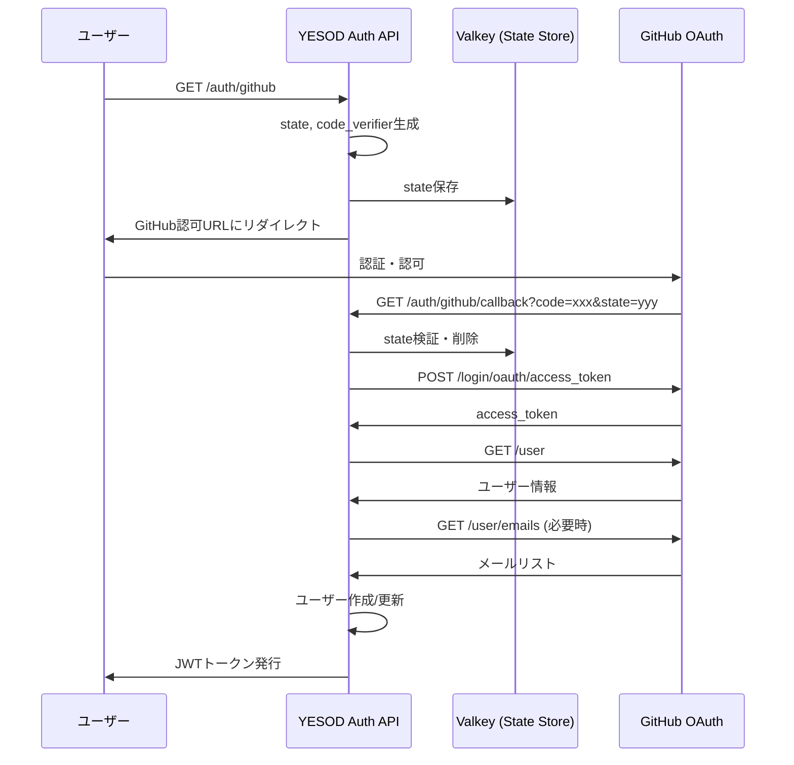

# 設計ドキュメント: GitHub OAuth認証プロバイダー

## 概要

GitHub OAuth 2.0認証プロバイダーをYESOD Authに追加する。既存のGoogleOAuth、DiscordOAuthクラスと同じパターンで実装し、PKCEをサポートする。

## アーキテクチャ



## コンポーネントとインターフェース

### GitHubOAuthクラス

```python
class GitHubOAuth:
    """GitHub OAuth implementation with PKCE support."""

    AUTHORIZE_URL = "https://github.com/login/oauth/authorize"
    TOKEN_URL = "https://github.com/login/oauth/access_token"
    USERINFO_URL = "https://api.github.com/user"
    EMAILS_URL = "https://api.github.com/user/emails"

    @classmethod
    def get_authorize_url(
        cls,
        redirect_uri: str,
        state: str,
        code_challenge: str | None = None,
    ) -> str:
        """Get the GitHub OAuth authorization URL with optional PKCE."""
        ...

    @classmethod
    async def exchange_code(
        cls,
        code: str,
        redirect_uri: str,
        code_verifier: str | None = None,
    ) -> dict | None:
        """Exchange authorization code for tokens."""
        ...

    @classmethod
    async def get_user_info(cls, access_token: str) -> dict | None:
        """Get user info from GitHub."""
        ...

    @classmethod
    async def _get_primary_email(cls, access_token: str) -> str | None:
        """Get primary email from GitHub emails API."""
        ...
```

### 設定拡張

```python
# config.py に追加
class Settings:
    # OAuth - GitHub
    GITHUB_CLIENT_ID: str = read_secret("github_client_id", "")
    GITHUB_CLIENT_SECRET: str = read_secret("github_client_secret", "")
```

### ルーターエンドポイント

| エンドポイント | メソッド | 説明 |
|---------------|---------|------|
| `/auth/github` | GET | GitHub OAuth認証フロー開始 |
| `/auth/github/callback` | GET | GitHubからのコールバック処理 |

### Mock OAuth拡張

```python
# mock_oauth.py に追加
@dataclass
class MockOAuthUser:
    def to_github_format(self) -> dict:
        """Convert to GitHub userinfo format."""
        return {
            "id": int(self.id.split("-")[-1]) if "-" in self.id else 12345,
            "login": self.name.lower().replace(" ", ""),
            "name": self.name,
            "email": self.email,
            "avatar_url": self.picture,
        }
```

## データモデル

### GitHub APIレスポンス形式

**ユーザー情報 (`/user`)**:
```json
{
    "id": 12345678,
    "login": "octocat",
    "name": "The Octocat",
    "email": "octocat@github.com",
    "avatar_url": "https://avatars.githubusercontent.com/u/12345678"
}
```

**メールリスト (`/user/emails`)**:
```json
[
    {
        "email": "octocat@github.com",
        "primary": true,
        "verified": true
    }
]
```

### 内部データマッピング

| GitHub API | YESOD Auth |
|------------|------------|
| `id` | `provider_user_id` |
| `login` | - (参考情報) |
| `name` | `display_name` |
| `email` | `email` |
| `avatar_url` | `avatar_url` |

## 正確性プロパティ

*正確性プロパティとは、システムのすべての有効な実行において真であるべき特性や動作のことです。プロパティは人間が読める仕様と機械で検証可能な正確性保証の橋渡しとなります。*

### Property 1: 認可URL生成の完全性

*任意の* redirect_uri、state、code_challenge に対して、`get_authorize_url()` が生成するURLは以下を含む：
- `client_id` パラメータ
- `redirect_uri` パラメータ（入力値と一致）
- `scope` パラメータ（`read:user` と `user:email` を含む）
- `state` パラメータ（入力値と一致）
- code_challengeが提供された場合、`code_challenge` と `code_challenge_method=S256` パラメータ

**Validates: Requirements 1.2, 1.3, 1.4**

### Property 2: 無効なstateの拒否

*任意の* 無効または期限切れのstateに対して、コールバック処理はHTTP 400エラーを返し、トークン交換を実行しない。

**Validates: Requirements 2.2**

### Property 3: PKCEパラメータの伝播

*任意の* code_verifierに対して、`exchange_code()` がcode_verifierを受け取った場合、トークンリクエストにcode_verifierが含まれる。

**Validates: Requirements 2.4**

### Property 4: ユーザー情報の必須フィールド

*任意の* 有効なGitHubユーザーレスポンスに対して、`get_user_info()` が返すデータには以下が含まれる：
- `id`（数値）
- `email`（文字列、プライベートの場合はemails APIから取得）
- `name` または `login`（表示名として使用）
- `avatar_url`（文字列またはnull）

**Validates: Requirements 3.2**

### Property 5: MockOAuthUserのGitHubフォーマット

*任意の* MockOAuthUserインスタンスに対して、`to_github_format()` が返すdictには以下が含まれる：
- `id`（数値）
- `login`（文字列）
- `name`（文字列）
- `email`（文字列）
- `avatar_url`（文字列またはnull）

**Validates: Requirements 6.3**

### Property 6: エラーメッセージの安全性

*任意の* エラーレスポンスに対して、レスポンスボディには以下が含まれない：
- スタックトレース
- 内部ファイルパス
- データベースクエリ
- シークレットや認証情報

**Validates: Requirements 7.4**

## エラーハンドリング

### エラーケース一覧

| エラー | HTTPステータス | メッセージ | 対応 |
|--------|---------------|-----------|------|
| 無効なstate | 400 | "Invalid or expired state" | 監査ログに記録 |
| トークン交換失敗 | 400 | "Failed to exchange code" | 監査ログに記録 |
| ユーザー情報取得失敗 | 400 | "Failed to get user info" | 監査ログに記録 |
| ネットワークエラー | 500 | "Internal server error" | エラーログに記録 |

### エラーログ形式

```python
# 失敗時の監査ログ
await AuditLogger.log_login(
    db, None, "github", False, ip_address, device_info, "Error reason"
)
```

## テスト戦略

### テストアプローチ

**ユニットテスト**と**プロパティベーステスト**の両方を使用：

- **ユニットテスト**: 特定の例、エッジケース、エラー条件の検証
- **プロパティテスト**: 任意の入力に対する普遍的なプロパティの検証

### プロパティベーステスト設定

- ライブラリ: `hypothesis`
- 各プロパティテストは最低100回実行
- タグ形式: `# Feature: github-oauth, Property N: {property_text}`

### テストケース

#### ユニットテスト

1. **認可URL生成**
   - 基本的なURL生成
   - PKCEパラメータ付きURL生成
   - スコープの確認

2. **トークン交換**（モック使用）
   - 成功ケース
   - 失敗ケース（無効なコード）
   - PKCEありの成功ケース

3. **ユーザー情報取得**（モック使用）
   - 公開メールありのユーザー
   - プライベートメールのユーザー（emails API使用）
   - 失敗ケース

4. **Mock OAuth**
   - `to_github_format()` の出力確認
   - モックログインエンドポイント

#### プロパティテスト

1. **Property 1**: 認可URL生成の完全性
   - 任意のredirect_uri、state、code_challengeを生成
   - 生成されたURLをパースして必須パラメータを検証

2. **Property 5**: MockOAuthUserのGitHubフォーマット
   - 任意のMockOAuthUserを生成
   - `to_github_format()` の出力に必須フィールドが含まれることを検証

### テスト環境の考慮事項

- `TESTING=1` 環境変数でテストモードを有効化
- 監査ログはテスト環境でスキップ（SQLite非対応）
- Valkey操作は `conftest.py` でモック済み
- 外部API（GitHub）は `httpx` モックを使用

