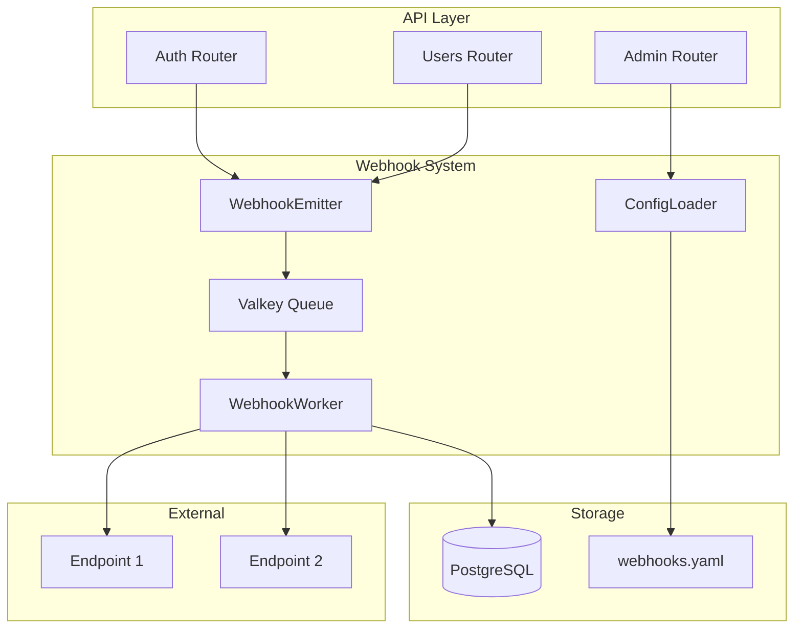

# Design Document: Webhook Feature

## Overview

This document describes the technical design for adding webhook functionality to the yesod-auth OAuth authentication system. The webhook system enables real-time event notifications to external services when user-related events occur.

The design follows the existing project patterns:
- FastAPI router structure under `api/app/webhooks/`
- Valkey (Redis-compatible) for async event queuing
- SQLAlchemy models for webhook delivery logging
- YAML configuration for endpoint registration (OSS-friendly approach)

## Architecture



### Event Flow

1. User action triggers an event (login, profile update, etc.)
2. `WebhookEmitter` creates event payload and pushes to Valkey queue
3. `WebhookWorker` (background task) consumes events from queue
4. Worker delivers to all subscribed endpoints with retry logic
5. Delivery results are logged to PostgreSQL

## Components and Interfaces

### WebhookEvent (Data Class)

```python
@dataclass
class WebhookEvent:
    event_id: uuid.UUID
    event_type: str  # e.g., "user.created"
    timestamp: datetime
    data: dict
    
    def to_payload(self) -> dict:
        """Convert to JSON-serializable payload."""
        return {
            "event_id": str(self.event_id),
            "event_type": self.event_type,
            "timestamp": self.timestamp.isoformat(),
            "data": self.data,
        }
```

### WebhookEndpoint (Configuration Model)

```python
@dataclass
class WebhookEndpoint:
    id: str  # Unique identifier
    url: str  # HTTPS URL
    secret: str  # HMAC signing secret
    events: list[str]  # Subscribed event types
    enabled: bool = True
    description: str = ""
```

### WebhookEmitter (Service)

```python
class WebhookEmitter:
    """Emits webhook events to the queue."""
    
    @staticmethod
    async def emit(event_type: str, data: dict) -> None:
        """Queue a webhook event for delivery."""
        pass
    
    @staticmethod
    async def emit_user_event(
        event_type: str,
        user_id: uuid.UUID,
        extra_data: dict | None = None,
    ) -> None:
        """Convenience method for user-related events."""
        pass
```

### WebhookWorker (Background Service)

```python
class WebhookWorker:
    """Processes webhook events from the queue."""
    
    async def start(self) -> None:
        """Start processing events."""
        pass
    
    async def stop(self) -> None:
        """Stop processing events."""
        pass
    
    async def deliver(
        self,
        event: WebhookEvent,
        endpoint: WebhookEndpoint,
    ) -> DeliveryResult:
        """Deliver event to endpoint with retries."""
        pass
```

### WebhookConfigLoader (Configuration)

```python
class WebhookConfigLoader:
    """Loads and manages webhook endpoint configurations."""
    
    CONFIG_PATH = "config/webhooks.yaml"  # Fixed location
    
    @classmethod
    def load(cls) -> list[WebhookEndpoint]:
        """Load endpoints from config/webhooks.yaml."""
        pass
    
    @classmethod
    def reload(cls) -> list[WebhookEndpoint]:
        """Reload configuration (for hot-reload)."""
        pass
    
    @classmethod
    def get_endpoints_for_event(cls, event_type: str) -> list[WebhookEndpoint]:
        """Get all endpoints subscribed to an event type."""
        pass
    
    @classmethod
    def resolve_secret(cls, secret_ref: str) -> tuple[str, bool]:
        """
        Resolve secret value from Docker Secrets or environment variable.
        Returns (secret_value, is_docker_secret).
        Logs warning if using environment variable.
        """
        pass
```

### WebhookSigner (Security)

```python
class WebhookSigner:
    """Signs webhook payloads for verification."""
    
    @staticmethod
    def sign(payload: str, secret: str, timestamp: int) -> str:
        """Generate HMAC-SHA256 signature."""
        pass
    
    @staticmethod
    def verify(
        payload: str,
        secret: str,
        timestamp: int,
        signature: str,
    ) -> bool:
        """Verify signature (for testing/documentation)."""
        pass
```

### Admin Router (API)

```python
# POST /api/v1/admin/webhooks/reload
async def reload_webhooks() -> dict:
    """Reload webhook configuration from file."""
    pass

# GET /api/v1/admin/webhooks/endpoints
async def list_endpoints() -> list[WebhookEndpointResponse]:
    """List all configured webhook endpoints."""
    pass

# GET /api/v1/admin/webhooks/deliveries
async def list_deliveries(
    event_type: str | None = None,
    endpoint_id: str | None = None,
    limit: int = 100,
) -> list[WebhookDeliveryResponse]:
    """List recent webhook deliveries."""
    pass
```

## Data Models

### WebhookDelivery (SQLAlchemy Model)

```python
class WebhookDelivery(Base):
    """Webhook delivery log entry."""
    
    __tablename__ = "webhook_deliveries"
    
    id: Mapped[uuid.UUID]  # Primary key
    event_id: Mapped[uuid.UUID]  # Reference to event
    event_type: Mapped[str]
    endpoint_id: Mapped[str]  # Reference to config
    endpoint_url: Mapped[str]  # Snapshot of URL at delivery time
    
    # Delivery status
    status: Mapped[str]  # "success", "failed", "pending"
    http_status: Mapped[int | None]
    error_message: Mapped[str | None]
    
    # Timing
    attempt_count: Mapped[int]
    latency_ms: Mapped[int | None]
    created_at: Mapped[datetime]
    completed_at: Mapped[datetime | None]
```

### Configuration File Format (config/webhooks.yaml)

```yaml
# Webhook endpoint configuration
# This file MUST be placed at config/webhooks.yaml
endpoints:
  - id: "analytics-service"
    url: "https://analytics.example.com/webhooks/yesod"
    secret: "${WEBHOOK_SECRET_ANALYTICS}"  # Docker Secret preferred: /run/secrets/webhook_secret_analytics
    events:
      - "user.created"
      - "user.deleted"
      - "user.login"
    enabled: true
    description: "Analytics service for user metrics"
    
  - id: "crm-integration"
    url: "https://crm.example.com/api/webhooks"
    secret: "${WEBHOOK_SECRET_CRM}"  # Docker Secret preferred: /run/secrets/webhook_secret_crm
    events:
      - "user.created"
      - "user.updated"
      - "user.deleted"
    enabled: true
    description: "CRM system integration"

# Global settings
settings:
  max_retries: 5
  retry_base_delay_seconds: 2  # Exponential backoff base
  delivery_timeout_seconds: 30
  log_retention_days: 30
```

### Secret Resolution Order

The system resolves secrets in the following order (first match wins):

1. **Docker Secrets** (recommended): `/run/secrets/<secret_name>`
2. **Environment Variables**: `${VAR_NAME}` syntax in YAML

If environment variables are used instead of Docker Secrets, a warning is logged at startup:

```
WARNING: Webhook secret 'WEBHOOK_SECRET_ANALYTICS' loaded from environment variable.
         For production, use Docker Secrets: /run/secrets/webhook_secret_analytics
         See: https://docs.docker.com/engine/swarm/secrets/
```

### Webhook Payload Format

```json
{
  "event_id": "550e8400-e29b-41d4-a716-446655440000",
  "event_type": "user.created",
  "timestamp": "2024-01-15T10:30:00Z",
  "webhook_id": "analytics-service",
  "data": {
    "user_id": "123e4567-e89b-12d3-a456-426614174000",
    "email": "user@example.com",
    "provider": "google"
  }
}
```

### HTTP Headers

```
Content-Type: application/json
X-Webhook-Signature: sha256=abc123...
X-Webhook-Timestamp: 1705312200
X-Webhook-Event: user.created
X-Webhook-ID: analytics-service
```

## Correctness Properties

*A property is a characteristic or behavior that should hold true across all valid executions of a system—essentially, a formal statement about what the system should do. Properties serve as the bridge between human-readable specifications and machine-verifiable correctness guarantees.*

### Property 1: User Lifecycle Events Trigger Webhooks

*For any* user lifecycle action (create, update, delete, oauth_link, oauth_unlink, login), the WebhookEmitter SHALL emit an event with the corresponding event type and user_id.

**Validates: Requirements 1.1, 1.2, 1.3, 1.4, 1.5, 1.6**

### Property 2: Payload Serialization Round-Trip

*For any* valid WebhookEvent object, serializing to JSON and then deserializing SHALL produce an equivalent object with identical event_id, event_type, timestamp, and data.

**Validates: Requirements 3.5, 3.6**

### Property 3: Payload Structure Completeness

*For any* webhook payload sent to an endpoint, the payload SHALL contain all required fields: event_id (valid UUID), event_type (non-empty string), timestamp (ISO 8601 format), webhook_id (matching endpoint config), and data.user_id (valid UUID for user events).

**Validates: Requirements 3.2, 3.3, 3.4**

### Property 4: Signature Computation Correctness

*For any* webhook delivery, the X-Webhook-Signature header SHALL equal the HMAC-SHA256 of (timestamp + payload_body) using the endpoint's secret key, and verifying with the same inputs SHALL return true.

**Validates: Requirements 4.1, 4.2, 4.3, 4.4**

### Property 5: HTTP 2xx Success Criteria

*For any* HTTP response status code, the delivery SHALL be marked successful if and only if the status code is in the range 200-299.

**Validates: Requirements 5.3**

### Property 6: Retry Exponential Backoff

*For any* sequence of failed delivery attempts, the delay between attempt N and attempt N+1 SHALL be greater than or equal to (base_delay * 2^N) seconds, up to the maximum retry count.

**Validates: Requirements 5.1, 5.2**

### Property 7: Event Ordering Preservation

*For any* sequence of events emitted to the same endpoint, the delivery attempts SHALL be made in the same order as the events were emitted.

**Validates: Requirements 5.6**

### Property 8: Configuration Validation

*For any* webhook endpoint configuration, the system SHALL reject it if: (a) the URL does not use HTTPS protocol, (b) the secret key is missing or empty, or (c) the events list is missing or empty.

**Validates: Requirements 2.2, 2.3, 4.6, 7.3, 7.4**

### Property 9: Delivery Logging Completeness

*For any* delivery attempt (success or failure), the log entry SHALL contain: timestamp, endpoint_id, endpoint_url, event_type, event_id, status, and http_status (if available). For failures, error_message SHALL be present. For successes, latency_ms SHALL be present.

**Validates: Requirements 6.1, 6.2, 6.3, 6.4**

### Property 10: Non-Blocking Async Delivery

*For any* API request that triggers a webhook event, the request response time SHALL not be affected by webhook delivery latency (delivery happens asynchronously after the response is sent).

**Validates: Requirements 8.1, 8.2**

## Error Handling

### Configuration Errors

| Error | Handling |
|-------|----------|
| YAML parse error | Log error, reject reload, keep existing config |
| Missing required field | Log validation error, reject endpoint |
| Invalid URL (non-HTTPS) | Log validation error, reject endpoint |
| Missing secret | Log validation error, reject endpoint |
| Duplicate endpoint ID | Log warning, use first occurrence |

### Delivery Errors

| Error | Handling |
|-------|----------|
| Connection timeout | Retry with exponential backoff |
| HTTP 4xx response | Log error, no retry (client error) |
| HTTP 5xx response | Retry with exponential backoff |
| DNS resolution failure | Retry with exponential backoff |
| TLS/SSL error | Log error, retry with exponential backoff |
| Max retries exceeded | Log final failure, mark as failed |

### Queue Errors

| Error | Handling |
|-------|----------|
| Valkey connection lost | Reconnect with backoff, events buffered in memory temporarily |
| Queue full | Log warning, drop oldest events (configurable) |
| Serialization error | Log error, skip event |

## Testing Strategy

### Unit Tests

Unit tests focus on specific examples and edge cases:

1. **WebhookSigner**: Test signature generation with known inputs/outputs
2. **WebhookConfigLoader**: Test YAML parsing with valid/invalid configs
3. **WebhookEvent**: Test payload serialization edge cases (special characters, large data)
4. **Validation**: Test URL validation, secret validation, event type validation

### Property-Based Tests

Property-based tests verify universal properties across randomized inputs. Each test runs minimum 100 iterations.

**Testing Framework**: `hypothesis` (Python property-based testing library)

**Test Configuration**:
```python
from hypothesis import given, settings, strategies as st

@settings(max_examples=100)
@given(...)
def test_property_name(...):
    # Feature: webhook, Property N: property_text
    pass
```

**Property Test Mapping**:

| Property | Test File | Test Function |
|----------|-----------|---------------|
| P1: Event emission | `test_webhook_emitter.py` | `test_user_events_trigger_webhooks` |
| P2: Round-trip | `test_webhook_event.py` | `test_payload_serialization_roundtrip` |
| P3: Payload structure | `test_webhook_event.py` | `test_payload_contains_required_fields` |
| P4: Signature | `test_webhook_signer.py` | `test_signature_computation_correctness` |
| P5: HTTP success | `test_webhook_worker.py` | `test_http_2xx_success_criteria` |
| P6: Retry backoff | `test_webhook_worker.py` | `test_retry_exponential_backoff` |
| P7: Event ordering | `test_webhook_worker.py` | `test_event_ordering_preservation` |
| P8: Config validation | `test_webhook_config.py` | `test_configuration_validation` |
| P9: Logging | `test_webhook_delivery.py` | `test_delivery_logging_completeness` |
| P10: Non-blocking | `test_webhook_emitter.py` | `test_nonblocking_async_delivery` |

### Integration Tests

Integration tests verify end-to-end flows:

1. **Full delivery flow**: Emit event → Queue → Deliver → Log
2. **Retry flow**: Emit event → Fail → Retry → Succeed
3. **Config reload**: Load config → Modify file → Reload → Verify changes

### Test Environment Considerations

Per project conventions:
- Tests use in-memory SQLite (`sqlite+aiosqlite:///:memory:`)
- Valkey operations are mocked in `conftest.py`
- Use `TESTING=1` environment variable to skip PostgreSQL-specific features
- Webhook delivery HTTP calls should be mocked using `httpx` mock or `respx`

